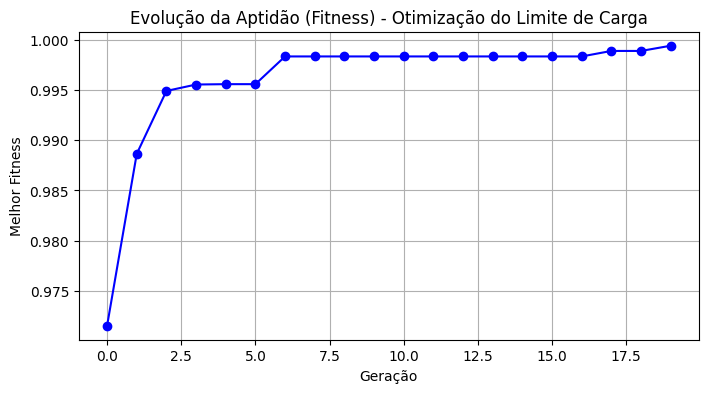

# 🚚 Projeto: Carregamento Autônomo de Caminhões (Docas Inteligentes)

### 1. Identificação do Grupo
**Instituição:** Faculdade Engenheiro Salvador Arena (FESA)  
**Curso:** Engenharia de Controle e Automação  
**Grupo:** GRUPO C  

**Integrantes:**
* **Guilherme Henrique Alves Vieira** - RA: 062220021
* **Gustavo de Freitas Lima** - RA: 062220015
* **Gabriel Santos de Oliveira** - RA: 062220028
* **Auro Manoel de Oliveira** - RA: 062220018

---

### 3. Área Problema Selecionada
Trilha tecnológica do projeto:
* [ ] Saúde 4.0: Robótica Assistiva (Controladores Inteligentes/Fuzzy)
* [ ] Smart Grid: Eficiência Energética e Descarbonização
* [ ] Agtech: Automação de Precisão e Visão Computacional
* [x] **Logística Autônoma: Coordenação de AGVs e Otimização de Rotas**

---

### 4. Diagnóstico e Definição do Agente
O agente inteligente atua na intralogística para resolver o gargalo do carregamento de carretas, operando em ambientes sujeitos a erros de empilhamento e fadiga humana.

#### Modelagem PEAS (Agente Inteligente)
| Componente | Descrição |
| :--- | :--- |
| **Performance (P)** | Preenchimento de $\ge$ 95% da capacidade; precisão de $\pm$ 2cm; redução de riscos via otimização. |
| **Ambiente (E)** | Interior de baús de caminhões, docas de carga e armazéns. |
| **Atuadores (A)** | Motores de tração elétrica, sistemas de elevação e sinalizadores. |
| **Sensores (S)** | LiDAR 3D, sensor ultrassônico **UGT583** e encoders. |

---

### 5. Arquitetura de IA (Etapa 3 - Inteligência Evolutiva)
Nesta etapa, implementamos a **Capacidade de Previsão e Otimização** do sistema:

* **Abordagem Escolhida:** Algoritmo Evolutivo (Algoritmos Genéticos).
* **Objetivo:** O sistema utiliza um Algoritmo Genético para encontrar o **limite de distância ideal (threshold)** para a transição entre as fases de "Aproximação" e "Carregamento".
* **Função de Aptidão (Fitness):** A lógica busca minimizar o erro em relação ao alvo de 0.35m, penalizando qualquer parâmetro que resulte em colisão (distância < 0.20m).
* **Integração com IA Generativa:** A **API do Gemini** atua como interface interpretativa, convertendo os parâmetros otimizados em explicações técnicas para o operador.

---

### 6. Resultados e Desempenho
O modelo demonstra aprendizado através da convergência da aptidão ao longo das gerações.

* **Métrica de Sucesso:** Gráfico de evolução da Aptidão (Fitness) apresentando curva ascendente.
* **Gráfico de Desempenho:**


### 1. Identificação do Grupo
**Instituição:** Faculdade Engenheiro Salvador Arena (FESA)  
**Curso:** Engenharia de Controle e Automação  
**Grupo:** GRUPO C  

**Integrantes:**
* **Guilherme Henrique Alves Vieira** - RA: 062220021
* **Gustavo de Freitas Lima** - RA: 062220015
* **Gabriel Santos de Oliveira** - RA: 062220028
* **Auro Manoel de Oliveira** - RA: 062220018

---

### 3. Área Problema Selecionada
Trilha tecnológica do projeto:
* [ ] Saúde 4.0: Robótica Assistiva (Controladores Inteligentes/Fuzzy)
* [ ] Smart Grid: Eficiência Energética e Descarbonização
* [ ] Agtech: Automação de Precisão e Visão Computacional
* [x] **Logística Autônoma: Coordenação de AGVs e Otimização de Rotas**

---

### 4. Diagnóstico e Definição do Agente
O agente inteligente atua na intralogística para resolver o gargalo do carregamento de carretas, operando em ambientes sujeitos a erros de empilhamento e fadiga humana.

#### Modelagem PEAS (Agente Inteligente)
| Componente | Descrição |
| :--- | :--- |
| **Performance (P)** | Preenchimento de $\ge$ 95% da capacidade; precisão de $\pm$ 2cm; redução de riscos via otimização. |
| **Ambiente (E)** | Interior de baús de caminhões, docas de carga e armazéns. |
| **Atuadores (A)** | Motores de tração elétrica, sistemas de elevação e sinalizadores. |
| **Sensores (S)** | LiDAR 3D, sensor ultrassônico **UGT583** e encoders. |

---

### 5. Arquitetura de IA (Etapa 3 - Inteligência Evolutiva)
Nesta etapa, implementamos a **Capacidade de Previsão e Otimização** do sistema:

* **Abordagem Escolhida:** Algoritmo Evolutivo (Algoritmos Genéticos).
* **Objetivo:** O sistema utiliza um Algoritmo Genético para encontrar o **limite de distância ideal (threshold)** para a transição entre as fases de "Aproximação" e "Carregamento".
* **Função de Aptidão (Fitness):** A lógica busca minimizar o erro em relação ao alvo de 0.35m, penalizando qualquer parâmetro que resulte em colisão (distância < 0.20m).
* **Integração com IA Generativa:** A **API do Gemini** atua como interface interpretativa, convertendo os parâmetros otimizados em explicações técnicas para o operador.

---

### 6. Resultados e Desempenho
O modelo demonstra aprendizado através da convergência da aptidão ao longo das gerações.

* **Métrica de Sucesso:** Gráfico de evolução da Aptidão (Fitness) apresentando curva ascendente.
* **Gráfico de Desempenho:**
* 


---

### 7. Estrutura do Repositório
* `/data`: Arquivos de dados originais e tratados.
* `/notebooks`: Implementação do Algoritmo Genético e integração com Gemini API.
* `requirements.txt`: Bibliotecas necessárias (`google-generativeai`, `matplotlib`).
* `README.md`: Documentação técnica.

---

### 8. Instruções para Execução
1. Instale as dependências:
```bash
pip install -q -U google-generativeai matplotlib)

---

### 7. Estrutura do Repositório
* `/data`: Arquivos de dados originais e tratados.
* `/notebooks`: Implementação do Algoritmo Genético e integração com Gemini API.
* `requirements.txt`: Bibliotecas necessárias (`google-generativeai`, `matplotlib`).
* `README.md`: Documentação técnica.

---

### 8. Instruções para Execução
1. Instale as dependências:
```bash
pip install -q -U google-generativeai matplotlib
