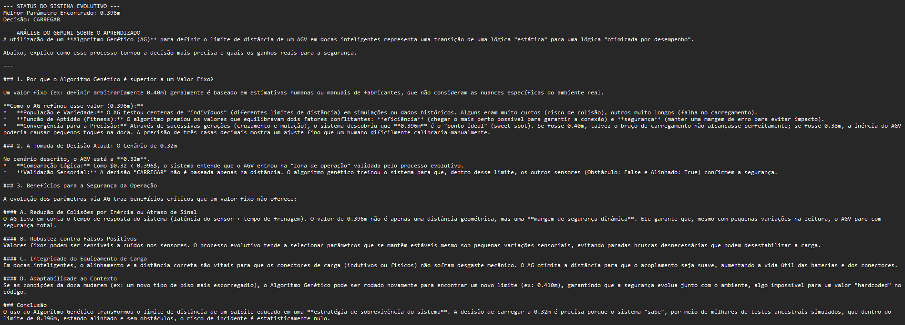

# 🚚 Projeto: Carregamento Autônomo de Caminhões (Docas Inteligentes)


### 🎥 Demonstração do Projeto
**[Assista ao Pitch e Demonstração da Solução](https://youtu.be/8WWDwyVPi_4))**

### 🚀 Link do Protótipo
**[PROTÓTIPO NO GOOGLE COLAB](https://colab.research.google.com/drive/1B8ZYhVq-1FwjWNzEokLpJ-BJm53Tuh68?usp=sharing)**

---

### 1. Identificação do Grupo
* **Instituição:** Faculdade Engenheiro Salvador Arena (FESA)
* **Curso:** Engenharia de Controle e Automação
* **Grupo:** GRUPO C
* **Integrantes:**
    * Guilherme Henrique Alves Vieira - RA: 062220021
    * Gustavo de Freitas Lima - RA: 062220015
    * Gabriel Santos de Oliveira - RA: 062220028
    * Auro Manoel de Oliveira - RA: 062220018

---

### 2. Área Problema Selecionada
Selecione a trilha tecnológica do projeto (marque com um [x]):
* [ ] **Saúde 4.0:** Robótica Assistiva (Controladores Inteligentes/Fuzzy)
* [ ] **Smart Grid:** Eficiência Energética e Descarbonização
* [ ] **Agtech:** Automação de Precisão e Visão Computacional
* [x] **Logística Autônoma:** Coordenação de AGVs e Otimização de Rotas

---

### 3. Diagnóstico e Definição do Agente
* **Contexto:** Inserido na Logística 4.0 e Intralogística, o sistema atua no processo de descarregamento e carregamento de frotas em centros de distribuição.
* **Problema:** Lentidão, periculosidade e ineficiência no carregamento manual de carretas, operando em ambientes sujeitos a erros de empilhamento e fadiga humana, o que gera gargalos operacionais e risco de acidentes.
* **Impacto:** Otimização instantânea do espaço (Tetris 3D), eliminação de danos à carga, fluidez na logística de pátio e garantia de segurança total aos colaboradores através de parâmetros evolutivos.

#### Modelagem PEAS
| Componente | Descrição |
| :--- | :--- |
| **Performance (P)** | Preenchimento de $\ge$ 95% da capacidade; precisão de $\pm$ 2cm; redução de riscos de colisão via otimização de threshold. |
| **Ambiente (E)** | Interior de baús de caminhões, docas de carga e pátios de armazéns. |
| **Atuadores (A)** | Motores de tração elétrica direcional, sistemas de elevação de carga e sinalizadores. |
| **Sensores (S)** | LiDAR 3D, sensor de distância (ex: ultrassônico) e encoders de roda. |

---

### 4. Arquitetura Lógica e Aprendizado
O **Docas Inteligentes** opera através de um pipeline de dados fluido e contínuo que garante segurança técnica e clareza para o operador de pátio:

1.  **Módulo de Otimização (Etapa 3):** Utiliza um **Algoritmo Genético (Evolutivo)** para descobrir e refinar o limite de distância ideal (*threshold*) de parada do AGV, maximizando a eficiência da aproximação e penalizando severamente o risco de colisão.
2.  **Módulo de Controle (Etapa 2):** Um **Sistema Especialista Baseado em Regras** recebe o limite otimizado pelo algoritmo genético e os dados em tempo real dos sensores (LiDAR/Alinhamento) para ditar a ação física imediata (Avançar, Corrigir Trajetória, Parada de Emergência ou Carregar).
3.  **Camada Interpretativa:** A **API do Gemini** atua como IA Explicável (XAI). Ela recebe a decisão do motor de controle e o parâmetro otimizado, gerando um prompt de auditoria humanizado que explica ao operador o motivo técnico da ação e o nível de confiabilidade do sistema naquele milissegundo.

---

### 5. Justificativa da Abordagem
Para o desenvolvimento do núcleo de inteligência deste projeto, foi selecionada a abordagem de **Algoritmos Evolutivos (Genéticos)**.

**Por que esta abordagem foi escolhida?**
* **Natureza do Problema:** O ambiente de uma doca de carga é altamente dinâmico (diferentes modelos de caminhão, ruídos no sensor LiDAR, atrito do piso). Encontrar o ponto exato de parada de um AGV com carga pesada usando "regras fixas" ou ajustes manuais é ineficiente e perigoso.
* **Capacidade de Otimização:** A abordagem evolutiva foi escolhida por sua capacidade de explorar um grande espaço de soluções possíveis (distâncias de frenagem/aproximação). A função de *Fitness* garante que o sistema evolua para uma configuração ótima que minimiza o tempo de manobra sem ultrapassar a margem de colisão.
* **Escalabilidade:** O AG permite que o sistema se re-calibre autonomamente caso o AGV seja movido para uma doca diferente ou receba um upgrade de hardware (sensores mais precisos), adaptando-se às novas condições sem reescrever o código do sistema especialista.

---

### 6. Evidências Visuais e Desempenho
*Arquivos armazenados na pasta `/assets/images`.*

**Imagem 1: Gráfico de Evolução da Aptidão (Fitness)**
*O gráfico demonstra a convergência do Algoritmo Genético ao longo das gerações. O sistema "aprende" rapidamente a fugir das distâncias de colisão (fitness = 0) e estabiliza no threshold ideal para a operação.*


**Imagem 2: Log de Execução e IA Explicável (XAI)**
*Pipeline em ação: Integração fluida entre o Motor de Decisão Otimizado e o Output Textual gerado pela API do Gemini, provando a mitigação do efeito "Caixa Preta".*


---

### 7. Estrutura do Repositório
* `/assets/images`: Prints de gráficos (Aptidão) e logs de execução do Gemini.
* `/data`: (Opcional) Logs de telemetria simulada dos sensores.
* `/notebooks`: Notebook `.ipynb` principal contendo o pipeline unificado, *Try/Catch* de exceções e IA.
* `requirements.txt`: Lista de dependências (`google-generativeai`, `matplotlib`, `numpy`).
* `README.md`: Esta documentação técnica.

---

### 8. Instruções para Execução
1. Clone o repositório:
   ```bash
   git clone [https://github.com/GuilhermeVieira1202/Atv_1.PROJETO-GitHub.git](https://github.com/GuilhermeVieira1202/Atv_1.PROJETO-GitHub.git)
   
2. Instale as dependências:
   ```bash
   pip install -r requirements.txt

3. Abra o arquivo na pasta `/notebooks` via Google Colab.
4. **Importante:** Insira sua `GOOGLE_API_KEY` na célula de configuração da API do Gemini para habilitar a camada interpretativa.
5. Execute todas as células sequencialmente. O sistema conta com *Try/Catch* na camada de IA para garantir que o AGV opere em contingência caso haja falha de conexão.
   
---

## 🤖 9. Apêndice de IA

Relato sobre o suporte de ferramentas de Inteligência Artificial Generativa no desenvolvimento:

* **Ferramentas:** Gemini 3.0 Flash (via API) e Gemini Advanced (via interface web).
* **Aplicação:** Apoio na transição da modelagem lógica para a modelagem matemática (desenvolvimento da função de *Fitness*), estruturação de blocos com *Clean Code*, geração de cenários simulados para os sensores e formatação do repositório no GitHub.
* **Validação:** Todos os limites matemáticos evoluídos pelo algoritmo e as métricas de segurança geradas pelas respostas do Gemini foram analisados criticamente pelo grupo para garantir coerência com as normas de automação e segurança industrial.

---
© 2026 - Projeto de Inteligência Artificial - Faculdade Engenheiro Salvador Arena
